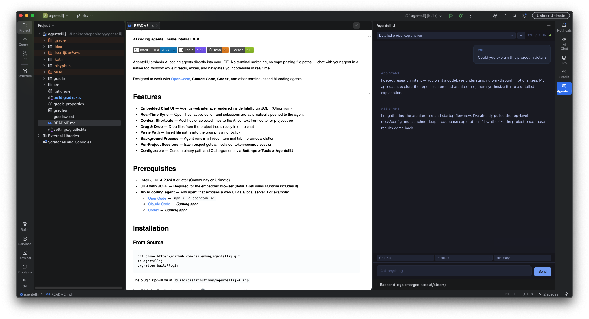

# AgentellIJ

**AI coding agents, inside IntelliJ IDEA.**

[](https://plugins.jetbrains.com/plugin/com.agentellij)
[](https://www.jetbrains.com/idea/)
[](https://kotlinlang.org/)
[](https://openjdk.org/)
[](LICENSE)

AgentellIJ embeds AI coding agents directly into your IDE. No terminal switching, no copy-pasting file paths — chat with your agent in a native tool window while it reads, writes, and navigates your codebase in real time.

Designed to work with **[OpenCode](https://github.com/sst/opencode)**, **Claude Code**, **Codex**, and other terminal-based AI coding agents.



## Features

- **Embedded Chat UI** — Agent's web interface rendered inside IntelliJ via JCEF (Chromium)
- **TUI & GUI Modes** — Switch between terminal and browser-based UI instantly via the toolbar toggle button
- **Real-Time Sync** — Open files, active editor, and selections are automatically pushed to the agent
- **Context Shortcuts** — Add files or selected lines to the AI context from editor or project tree (`Ctrl+Shift+I` / `Cmd+Shift+I`)
- **Drag & Drop** — Drop files from the project tree directly into the chat
- **Background Process** — Agent runs in a hidden terminal tab; no window clutter
- **Per-Project Sessions** — Each project gets an isolated, token-secured bridge session
- **Configurable** — Custom binary path and CLI arguments via **Settings > Tools > AgentellIJ**

## Prerequisites

- **IntelliJ IDEA** 2025.1 or later (Community or Ultimate)
- **JBR with JCEF** — Required for the embedded browser (default JetBrains Runtime includes it)
- **An AI coding agent** — Any terminal-based AI coding agent. For example:
  - [OpenCode](https://github.com/sst/opencode) — `npm i -g opencode-ai`
  - [Claude Code](https://docs.anthropic.com/en/docs/claude-code) — `npm i -g @anthropic-ai/claude-code`
  - [Codex CLI](https://github.com/openai/codex) — `npm i -g @openai/codex`

## Installation

### From JetBrains Marketplace

Install directly from your IDE: **Settings > Plugins > Marketplace** — search **"AgentellIJ"**.

### From Source

```bash
git clone https://github.com/hei5enbug/agentellij.git
cd agentellij
./gradlew buildPlugin
```

The plugin zip will be at `build/distributions/agentellij-*.zip`.

Install it in IntelliJ: **Settings > Plugins > ⚙️ > Install Plugin from Disk...**

## Usage

### Opening the Chat

Click the **AgentellIJ** tool window on the right sidebar (or find it via **View > Tool Windows > AgentellIJ**). The plugin will automatically:

1. Launch the agent backend in a hidden terminal tab
2. Detect the server URL from stdout
3. Load the web UI in the embedded browser

AgentellIJ supports two tool-window modes. **TUI mode** is the default and runs the agent's interactive CLI directly inside the tool window through the terminal wrapper. **GUI mode** uses the JCEF-powered embedded web UI.

You can switch between modes at any time using the toggle button in the tool window toolbar — no restart required.

### Keyboard Shortcuts

All context actions share a single smart shortcut — the plugin automatically selects the appropriate action (file, lines, or directory) based on focus and selection state.

| Action | Windows / Linux | macOS |
|---|---|---|
| Add to context | `Ctrl+Shift+I` | `Cmd+Shift+I` |

### Context Menu Actions

Right-click in the **editor** or **editor tab**:
- **AgentellIJ: Add File to Context** — Sends the full file path. The same shortcut (`Ctrl+Shift+I` / `Cmd+Shift+I`) triggers this when the editor or tab is focused without a text selection.
- **AgentellIJ: Add Lines to Context** — Sends the file path with line range (e.g., `src/Main.kt:10-25`). The same shortcut triggers this when text is selected in the editor.

Right-click in the **Project tree**:
- **AgentellIJ: Add to Context** — Sends selected file(s) or directory. The same shortcut triggers this when focus is in the project tree.

### Drag & Drop

Drag files from IntelliJ's project tree and drop them onto the chat window to add them as context.

## Configuration

**Settings > Tools > AgentellIJ**

Use the **Mode** dropdown to set the default mode on startup, or use the **toolbar toggle button** in the tool window to switch between GUI and TUI instantly at any time. AgentellIJ validates the selected mode against the active agent, so terminal-only agents such as Claude Code and Codex CLI stay in TUI mode. The rest of the settings apply in both modes, including custom binary path and additional CLI arguments.

If the selected agent CLI is missing, AgentellIJ shows an install prompt with the exact command it will run. Installation only starts after you click **Install**; you can also open settings, configure a custom binary path, or retry detection without installing anything.

| Setting | Description | Default |
|---|---|---|
| Agent | Which AI coding agent to use | `OpenCode` |
| Mode | Tool window runtime: interactive terminal (**TUI**) or embedded web UI (**GUI**) | `TUI` |
| Agent binary path | Absolute path to the agent executable | _(empty — auto-detects from `PATH` or common install locations)_ |
| Additional arguments | Extra CLI args appended after the agent binary; quoted values and escaped spaces are preserved | _(empty)_ |

Bridge sessions are project-specific, but persistent agent state such as OpenCode `kv.json`, `model.json`, and `settings.json` follows the agent profile's state directory. Treat that state as user/agent scoped unless a future project-scoped state store is introduced.

### Environment Variables

| Variable | Description |
|---|---|
| `AGENTELLIJ_BIN` | Path to the agent binary (overrides `PATH` lookup) |
| `OPENCODE_BIN` | Legacy fallback for OpenCode users |
| `CLAUDE_CODE_BIN` | Path to the Claude Code binary |
| `CODEX_BIN` | Path to the Codex CLI binary |
| `CODEX_INSTALL_DIR` | Codex CLI install directory scanned during auto-detection |
| `CODEX_HOME` | Codex home directory used to scan managed standalone installs |

**Resolution order:** Settings path > `AGENTELLIJ_BIN` > agent-specific env vars (e.g., `OPENCODE_BIN`, `CLAUDE_CODE_BIN`, `CODEX_BIN`) > discovered binary (`PATH` first, then common install locations) > agent's default binary name

## Architecture

```
com.agentellij
├── actions/           # IDE actions (context menu, shortcuts)
│   ├── AddFileToContextAction     # Editor/tab → add file to context
│   ├── AddLinesToContextAction    # Editor → add selected lines to context
│   ├── AddDirectoryToContextAction # Project tree → add file(s)/directory
│   └── AgentellIJActionPromoter   # Prioritizes AgentellIJ actions in menus
├── backend/           # Agent process lifecycle & profile management
│   ├── AgentProfile               # Interface: agent-specific behavior
│   ├── CustomArgsParser           # Shell-like parser for additional CLI arguments
│   ├── AgentProfileResolver       # Resolves profile from settings/env
│   ├── OpenCodeProfile            # OpenCode agent implementation
│   ├── ClaudeCodeProfile          # Claude Code agent implementation
│   ├── CodexCliProfile            # Codex CLI agent implementation
│   ├── BackendLauncher            # Launches agent process with fallback
│   ├── BackendProcess             # Process abstraction interface
│   ├── DirectBackendProcess       # Direct process with piped stdout
│   └── TerminalBackendProcess     # Terminal widget wrapper
├── bridge/            # IDE ↔ Agent communication (HTTP + SSE)
│   ├── IdeBridge                  # HTTP server on localhost (random port)
│   ├── BridgeSession              # Per-project session with token auth
│   ├── SessionInfo                # Session URL, token, and ID for clients
│   ├── AgentStateStore            # kv/model/settings JSON state I/O
│   └── MessageHandler             # Routes: openFile, openUrl, reloadPath, kv, model, settings
├── context/           # Context passing to agent
│   ├── ProjectPathResolver        # Shared absolute/project-relative path normalization
│   ├── ContextSender              # Sends file paths via bridge
│   └── DragDropHandler            # AWT drag-and-drop → context
├── settings/          # Plugin configuration (persistent state)
│   ├── AgentellIJSettings         # State: binary path, custom args
│   ├── AgentModePolicy            # Validates modes against agent capabilities
│   └── AgentellIJConfigurable     # Settings UI panel
├── ui/                # Tool window and browser
│   ├── ChatToolWindowFactory      # Mode dispatcher (GUI vs TUI)
│   ├── GuiModeContent             # JCEF browser + backend orchestration
│   ├── TuiModeContent             # Terminal widget wrapper for interactive CLI
│   └── OpenFilesTracker           # Syncs open/active files to agent
└── util/              # Shared utilities
    ├── DebouncedTask              # Coalesces rapid event bursts
    └── SafeUtils                  # closeQuietly, runQuietly, binary path resolution
```

### Communication Flow

```
IntelliJ IDEA                          Agent Backend
┌─────────────┐                    ┌──────────────┐
│  Tool Window │◄── JCEF browser ──│   Web UI     │
│  (right bar) │                   │  (/app)      │
└──────┬───────┘                   └──────┬───────┘
       │                                  │
       ▼                                  ▼
┌─────────────┐    HTTP + SSE     ┌──────────────┐
│  IdeBridge   │◄────────────────►│  JS client   │
│  (localhost) │  token-secured   │  (in JCEF)   │
└──────┬───────┘                  └──────────────┘
       │
       ▼
┌─────────────────────────────────────────────────┐
│  MessageHandler                                  │
│  openFile · openUrl · reloadPath                 │
│  kv/model/settings routes via AgentStateStore    │
└──────────────────────────────────────────────────┘
```

## Development

### Build

```bash
./gradlew build
```

### Run in IDE Sandbox

```bash
./gradlew runIde
```

This launches a sandboxed IntelliJ instance with the plugin pre-installed.

### Run Tests

```bash
./gradlew test
```

### Verify Plugin Compatibility

```bash
./gradlew verifyPlugin
```

Runs JetBrains Plugin Verifier against recommended IDE versions.

### CI

GitHub Actions runs `./gradlew test`, `./gradlew build`, and `./gradlew verifyPlugin` on pull requests and pushes to `main`.

### Project Requirements

- JDK 21
- Gradle 9.4 (wrapper included)

## Contributing

Contributions are welcome! Please open an issue first to discuss what you'd like to change.

1. Fork the repository
2. Create your feature branch (`git checkout -b feature/my-feature`)
3. Commit your changes (`git commit -m 'Add my feature'`)
4. Push to the branch (`git push origin feature/my-feature`)
5. Open a Pull Request

## License

This project is licensed under the MIT License — see the [LICENSE](LICENSE) file for details.
