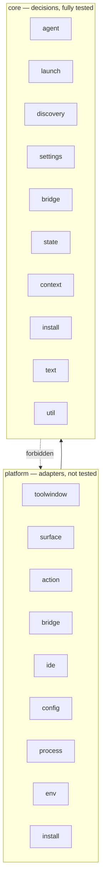

# Architecture

How the code is divided, and the rules that keep it that way.

## The dividing question

Every file answers one question: can this run without IntelliJ?

Code that can lives in `core`. Code that cannot lives in `platform`. There is no third answer.

The question was chosen because it is mechanically decidable. A reviewer never has to argue about
whether something is "business logic"; the build checks the answer instead. The previous layout
divided by topic, which required judgement at every boundary, and its own record of unresolved
violations grew to twenty-five entries before it was replaced.

The split also decides what is tested. `core` is tested exhaustively because it can be. `platform` is
not, because testing a browser widget or a terminal panel costs more than it proves.

## The two layers

## What core means

Three conditions, all required.

| Condition | Meaning |
|---|---|
| Independent of IntelliJ | No IntelliJ platform type is imported |
| Asks rather than looks | Environment variables, the clock, the home directory and the search path arrive as arguments |
| Decides the same way twice | Given the same inputs, the same result |

The test is not whether a library is involved. Jackson is used in `core` because it satisfies all
three. A function that reads the clock does not, even though it imports nothing unusual.

Work with side effects can still live in `core`, provided the outside world arrives through an
argument.

| Effect | How core is allowed to have it |
|---|---|
| Reading or writing a file | The file is passed in; `core` never goes looking for one |
| Waiting on or killing a process | Through an injected handle, not `Process` directly |
| The current time | Through an injected clock |
| Reporting a problem | Through an injected diagnostics channel, not the IDE log |

## Package responsibilities

### core

| Package | Holds |
|---|---|
| `agent` | The agent contract, the four agent records, the catalogue, install commands, state directory resolution, completion-adapter rendering |
| `launch` | Binary priority, launch command planning, terminal shell wrapping, recovery after a failed start, output capture loops, start-up attempt tracking |
| `discovery` | Which directories to search and in what order, node tooling locations, `.npmrc` parsing |
| `settings` | Setting shapes, mode rules, active agent selection, per-agent paths, settings panel decisions |
| `bridge` | Request parsing, authorization, cross-origin decisions, asset paths, message envelopes, the web client address, completion validation and deduplication |
| `state` | Shape rules and merge rules for the agent's state files, and how they are written safely |
| `context` | Path shaping, the line range notation, shared shortcut priority |
| `install` | The install run: output cap, time limit, cancellation |
| `text` | Argument parsing, shell quoting, HTML escaping |
| `util` | Debouncing, quiet closing, the diagnostics contract |

### platform

| Package | Holds |
|---|---|
| `toolwindow` | The tool window entry point, the toolbar, and the wiring that joins settings to the catalogue |
| `surface` | The terminal surface, the web surface, the missing-agent panel |
| `action` | The three context actions and the shortcut promoter |
| `bridge` | The HTTP server, session registry, event streams, route dispatch, IntelliJ completion notifications |
| `ide` | Editor and file access, selection capture, open file tracking, drag and drop |
| `config` | The persisted settings service and the settings panel |
| `process` | Process handles for a directly spawned agent and for one inside a terminal widget, terminal-scoped completion adapters |
| `env` | The real machine: environment, filesystem, path lookup, IDE logging |
| `install` | The background install task and its notifications |

## Rules

### Rule 1: core imports nothing from the outside

No IntelliJ platform, terminal or browser integration, Swing or AWT, HTTP server, or
`com.agentellij.platform`.

### Rule 2: core does not read its surroundings

No environment variables, system properties, clock reads, or process creation. These arrive as
arguments.

### Rule 3: directions inside core are fixed

Free reference between `core` packages produces cycles. An early draft had one: agent records call
the argument parser, and the parser was going to live beside the code that uses the records. Moving
string handling down to `text` broke it.

| Package | May be referenced by |
|---|---|
| `util` | everything |
| `text` | `agent`, `launch`, `install` |
| `agent` | `launch`, `settings` |
| `discovery` | `launch` |
| `context` | `bridge` |
| `launch`, `settings`, `state`, `bridge`, `install` | nothing |

### Rule 4: capabilities arrive as arguments

A single capability is a function parameter. Three or more that travel together become a named
interface, declared in `core` and implemented in `platform`. `SystemProbe` and `InstallProcess` exist
for that reason.

### Rule 5: two files may read the settings service

`platform/toolwindow/AgentellIJWiring.kt` and `platform/config`. Everything else asks the wiring.

The rule limits where global state is read, not whether it is read at runtime. Callers ask the wiring
on each call rather than holding a value, because an agent switch has to take effect immediately.

`AgentellIJWiring` is a service locator, not constructor injection. Three of the context
actions are created by the IDE itself, so there is no seam to inject through, and giving
only the surfaces injected dependencies would have split the rule in two. The cost is
that a platform adapter cannot be exercised against described settings; the benefit is
that there is one answer to "which agent is active". Anything worth testing is pushed
into `core` instead.

### Rule 6: a name is declared once

Two declarations sharing a name force alias imports at every use. Three classes were once called
`AgentProfileResolver`; they are now `AgentCatalog`, `ActiveAgentSelector` and `AgentellIJWiring`, and
no alias import remains.

## How the rules hold

Rules 1, 2, 3, 5 and 6 are checked by `LayeringSpec`, which reads the source tree and fails the build
on a violation. Rules 3 and 5 are also encoded there as tables, so changing an allowed direction means
changing the test.

The scan strips comments and string literals first. Without that it would report the settings
component name, which deliberately contains a package that no longer exists.

Rule 4 is not mechanically checkable and is left to review.

## Where the object graph is assembled

`platform/toolwindow` is the composition root. It reads the settings, resolves the active agent,
chooses and builds the surface, and owns the disposable whose lifetime is one mode.

Switching modes disposes the outgoing surface before building the next one, so a surface never
outlives the screen it drew. The package that wraps a resource owns tearing it down; the composition
root owns only the disposable that triggers it.

## What is not tested, and why

The following have no automated coverage. Each needs a running IDE, and exercising it would cost more
than the confidence it returns.

- Browser creation and rendering on the web surface
- Terminal widget creation, key forwarding, and the mouse motion filter
- Tool window content swapping
- Action registration and shortcut binding
- Settings panel components
- Background task progress and notifications

Six platform pieces are tested anyway, because each runs without a heavy fixture and each fails in a
way the user would notice: static asset serving, bridge authentication and messaging, completion
message delivery, terminal completion runtime wiring, selection capture, and shortcut priority.

Verification commands and testing rules are in `docs/development.md`, under "Verification" and
"Testing rules".
