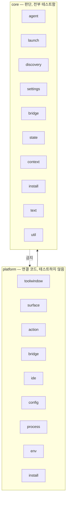

# 구조

코드를 어떻게 나눴고, 그 상태를 무엇이 지키는지.

## 나누는 질문

모든 파일이 질문 하나에 답합니다. **이 코드는 IntelliJ 없이 돌아갈 수 있는가?**

돌아갈 수 있으면 `core`, 없으면 `platform`입니다. 세 번째 답은 없습니다.

이 질문을 고른 이유는 기계가 판정할 수 있기 때문입니다. "이게 업무 로직인가"를 두고 리뷰에서 다툴 일이
없고, 대신 빌드가 답을 확인합니다. 이전 구조는 주제별로 나눴는데, 경계마다 사람의 판단이 필요했고,
지키지 못한 항목을 적어둔 목록이 스물다섯 개까지 자란 뒤에 교체됐습니다.

이 구분은 무엇을 테스트할지도 정합니다. `core`는 테스트할 수 있으니 빠짐없이 테스트합니다. `platform`은
브라우저 위젯이나 터미널 패널을 테스트하는 비용이 얻는 확신보다 커서 테스트하지 않습니다.

## 두 계층

## core의 뜻

조건 셋을 모두 만족해야 합니다.

| 조건 | 뜻 |
|---|---|
| IntelliJ에 기대지 않음 | IntelliJ 타입을 하나도 가져다 쓰지 않는다 |
| 찾지 않고 물어봄 | 환경 변수, 시각, 홈 폴더, 실행 파일 검색 경로를 인자로 받는다 |
| 두 번 해도 같은 답 | 같은 입력이면 같은 결과 |

판정 기준은 라이브러리 유무가 아닙니다. Jackson은 세 조건을 모두 만족해서 `core`에서 씁니다. 반대로
시각을 직접 읽는 함수는 특별한 것을 가져다 쓰지 않아도 `core`가 아닙니다.

바깥에 영향을 주는 일도 `core`에 둘 수 있습니다. 다만 바깥 세계가 인자로 들어와야 합니다.

| 하는 일 | core에서 허용되는 방식 |
|---|---|
| 파일 읽기·쓰기 | 대상 파일을 인자로 받는다. 스스로 찾지 않는다 |
| 프로세스 기다리기·끝내기 | 프로세스를 직접 쓰지 않고 주입된 창구로 |
| 현재 시각 | 주입된 시계로 |
| 문제 알리기 | IDE 로그가 아니라 주입된 진단 통로로 |

## 패키지가 맡는 것

### core

| 패키지 | 담는 것 |
|---|---|
| `agent` | 에이전트 계약, 4종 기록, 목록, 설치 명령, 상태 폴더 계산, 완료 어댑터 생성 |
| `launch` | 실행 파일 우선순위, 실행 명령 계획, 셸 감싸기, 실행 실패 복구, 출력 수집 반복, 기동 시도 추적 |
| `discovery` | 어떤 폴더를 어떤 순서로 뒤질지, Node 도구 위치, `.npmrc` 해석 |
| `settings` | 설정 값의 모양, 모드 규칙, 활성 에이전트 선택, 에이전트별 경로, 설정 화면 판단 |
| `bridge` | 요청 해석, 인증, 출처 판정, 자원 경로, 메시지 봉투, 웹 화면 주소, 완료 신호 검증과 중복 제거 |
| `state` | 에이전트 상태 파일의 모양·병합 규칙과 안전하게 쓰는 방법 |
| `context` | 경로 다듬기, 줄 범위 표기, 공유 단축키 우선순위 |
| `install` | 설치 실행: 출력 상한, 시간 제한, 취소 |
| `text` | 인자 해석, 셸 따옴표, HTML 이스케이프 |
| `util` | 몰아치는 요청 묶기, 조용한 닫기, 진단 통로 계약 |

### platform

| 패키지 | 담는 것 |
|---|---|
| `toolwindow` | 도구 창 진입점, 툴바, 설정과 에이전트 목록을 잇는 조립 코드 |
| `surface` | 터미널 화면, 웹 화면, 설치 안내 화면 |
| `action` | 컨텍스트 액션 3종과 단축키 우선순위 적용 |
| `bridge` | HTTP 서버, 세션 보관, 이벤트 스트림, 라우트 실행, IntelliJ 완료 알림 |
| `ide` | 편집기와 파일 접근, 선택 영역 수집, 열린 파일 추적, 끌어다 놓기 |
| `config` | 설정 저장 서비스와 설정 화면 |
| `process` | 직접 띄운 에이전트와 터미널 위젯 안 에이전트의 프로세스 창구, 터미널 세션 완료 어댑터 |
| `env` | 실제 기기: 환경 변수, 파일 시스템, 경로 조회, IDE 로그 |
| `install` | 백그라운드 설치 작업과 알림 |

## 규칙

### 규칙 1: core는 바깥에서 아무것도 가져오지 않는다

IntelliJ, 터미널·브라우저 연동, Swing과 AWT, HTTP 서버, 그리고 `com.agentellij.platform` 모두 금지입니다.

### 규칙 2: core는 주변을 읽지 않는다

환경 변수, 시스템 속성, 시각, 프로세스 생성 모두 금지입니다. 전부 인자로 받습니다.

### 규칙 3: core 안의 방향은 정해져 있다

`core` 안에서 자유롭게 참조하면 순환이 생깁니다. 실제로 초안에 하나 있었습니다. 에이전트 기록이 인자
해석기를 부르는데, 그 해석기를 기록을 쓰는 코드 옆에 두려 했기 때문입니다. 문자열만 다루는 도구를
`text`로 내려서 끊었습니다.

| 패키지 | 이 패키지를 참조해도 되는 곳 |
|---|---|
| `util` | 전부 |
| `text` | `agent`, `launch`, `install` |
| `agent` | `launch`, `settings` |
| `discovery` | `launch` |
| `context` | `bridge` |
| `launch`, `settings`, `state`, `bridge`, `install` | 없음 |

### 규칙 4: 능력은 인자로 들어온다

능력이 하나면 함수 인자입니다. 셋 이상이 늘 함께 다니면 이름 있는 창구로 묶어, `core`가 선언하고
`platform`이 구현합니다. `SystemProbe`와 `InstallProcess`가 그래서 있습니다.

### 규칙 5: 설정 서비스를 읽는 파일은 둘뿐이다

`platform/toolwindow/AgentellIJWiring.kt`와 `platform/config`입니다. 나머지는 조립 코드에 물어봅니다.

이 규칙이 정하는 것은 전역 상태를 **어디서** 읽느냐이지, 실행 중에 읽느냐가 아닙니다. 값을 한 번 받아
들고 있지 않고 필요할 때마다 물어보는 이유는, 에이전트를 바꾸면 곧바로 반영돼야 하기 때문입니다.

`AgentellIJWiring`은 생성자 주입이 아니라 서비스 로케이터입니다. 컨텍스트 액션 셋은 IDE가 직접 만들기
때문에 주입할 자리가 없고, 화면에만 주입하면 규칙이 둘로 갈라집니다. 대가는 platform 어댑터를 가짜
설정으로 따로 검증할 수 없다는 것이고, 얻는 것은 "지금 어떤 에이전트인가"에 대한 답이 하나뿐이라는
점입니다. 검증할 가치가 있는 것은 대신 `core`로 밀어냅니다.

### 규칙 6: 같은 이름은 한 번만 선언한다

이름이 겹치면 쓰는 곳마다 별칭을 붙여야 합니다. 예전에는 `AgentProfileResolver`라는 이름이 세 곳에
있었습니다. 지금은 `AgentCatalog`, `ActiveAgentSelector`, `AgentellIJWiring`이고 별칭은 하나도 없습니다.

## 규칙을 지키는 장치

규칙 1, 2, 3, 5, 6은 `LayeringSpec`이 소스를 읽어 검사하고 어기면 빌드를 막습니다. 규칙 3과 5는 그
테스트 안에 표로 적혀 있어서, 허용 방향을 바꾸려면 테스트를 고쳐야 합니다.

검사 전에 주석과 문자열을 걷어냅니다. 그러지 않으면 설정 저장소 이름이 걸립니다. 그 이름에는 지금은
없는 패키지가 일부러 남아 있습니다.

규칙 4는 기계로 확인할 수 없어 리뷰에 맡깁니다.

## 조립하는 곳

`platform/toolwindow`가 조립 지점입니다. 설정을 읽고, 활성 에이전트를 정하고, 화면을 골라 만들고, 모드
하나만큼 사는 해제 담당자를 소유합니다.

모드를 바꿀 때는 새 화면을 만들기 전에 이전 화면을 먼저 해제합니다. 화면이 자기가 그린 창보다 오래
살아남으면 안 되기 때문입니다. 자원을 감싼 쪽이 그 자원을 정리하고, 조립 지점은 정리를 촉발하는 담당자만
가집니다.

## 테스트하지 않는 것과 그 이유

아래는 자동 검사가 없습니다. 모두 실제 IDE가 필요하고, 확인하는 비용이 얻는 확신보다 큽니다.

- 웹 화면의 브라우저 생성과 그리기
- 터미널 위젯 생성, 키 전달, 마우스 움직임 걸러내기
- 도구 창 내용 교체
- 액션 등록과 단축키 연결
- 설정 화면 구성 요소
- 백그라운드 작업 진행 표시와 알림

`platform`이지만 테스트하는 것이 여섯 가지 있습니다. 모두 무거운 환경 없이 돌고, 실패하면 사용자가
바로 겪습니다. 정적 자원 서빙, 브리지 인증과 메시지 주고받기, 완료 메시지 전달, 터미널 완료 런타임
연결, 선택 영역 수집, 단축키 우선순위입니다.

검증 명령과 테스트 규칙은 `docs/ko/development.md`의 "검증"과 "테스트 규칙"에 있습니다.
