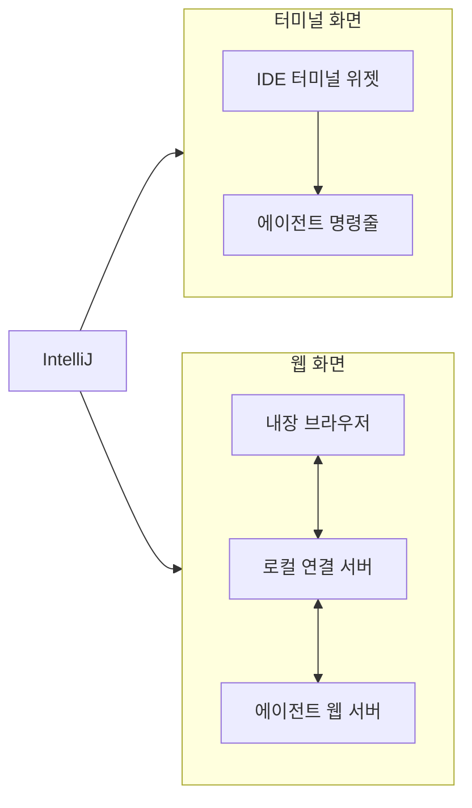

# 개요

AgentellIJ가 무엇을 하고, 어디에서 멈추는지.

## 이 플러그인이 하는 일

AgentellIJ는 터미널에서 쓰는 AI 코딩 에이전트를 IntelliJ IDEA 안에서 띄웁니다. 에이전트는 오른쪽 도구
창에서 계속 실행되면서, 열려 있는 파일을 알고, 편집기에서 파일을 다시 열어줄 수도 있습니다.

이 플러그인 안에는 에이전트가 들어 있지 않습니다. 사용자가 이미 가진 에이전트를 띄워줄 뿐입니다.

## 어디에서 멈추는가

대화, 판단, 도구 실행, 그리고 저장된 대화 기록은 에이전트 명령줄 도구가 가집니다. 플러그인은 그것을
보여주는 화면과, 거기에 넣어주는 IntelliJ 정보를 가집니다.

이 경계가 "이 요청이 여기 속하는가"를 판정합니다.

| 에이전트 도구가 가진 것 | 플러그인이 가진 것 |
|---|---|
| 대화와 그 기록 | 도구 창과 두 가지 화면 |
| 모델 선택과 지시문 | 지금 어떤 에이전트를 쓰는지, 그 실행 파일 경로 |
| 프로젝트 파일 읽고 쓰기 | 어떤 파일이 열려 있는지 알려주기 |
| 디스크에 저장된 대화 기록 | 그 기록을 웹 화면에 전달하기 |

여기에서 규칙 두 개가 나옵니다. 플러그인은 대화와 에이전트 기록의 주인이 되지 않고 전달만 합니다.
함께 들어 있는 웹 화면은 그려낸 내용을 잠시 보관해도 되지만, 그 보관함에는 반드시 크기 제한과 오래된
것을 밀어내는 규칙이 있어야 합니다. 플러그인이 쓰는 메모리는 곧 사용자의 IDE 메모리이기 때문입니다.

위 표 어디에도 해당하지 않는 요청은 플러그인이 아니라 에이전트 도구의 몫입니다.

## 지원하는 에이전트

| 에이전트 | 화면 | 설치 | 디스크에 대화 기록 |
|---|---|---|---|
| OpenCode | 터미널, 웹 | `npm install -g opencode-ai` | 있음, 전용 폴더 |
| Claude Code | 터미널 | `npm install -g @anthropic-ai/claude-code` | 없음 |
| Codex CLI | 터미널 | `npm install -g @openai/codex` | 없음 |
| Terminal | 터미널 | 필요 없음 | 없음 |

Terminal은 AI 에이전트가 아닙니다. 같은 도구 창에 IDE 자체의 셸을 열어주므로, 거기서 무엇을 실행하든
플러그인의 컨텍스트 단축키를 그대로 쓸 수 있습니다.

## 두 가지 화면

도구 창은 둘 중 하나를 보여줍니다. 툴바에서 다시 시작 없이 전환하며, 터미널만 지원하는 에이전트에서는
전환 버튼이 꺼집니다.

터미널 화면은 에이전트가 원래 제공하는 화면을 그대로 실행합니다. 웹 화면은 에이전트를 서버 모드로
띄우고, 주소를 알려올 때까지 기다렸다가, 그 웹 화면을 내장 브라우저에 불러옵니다. 웹 화면을 제공하는
에이전트는 OpenCode뿐이라 웹 화면도 OpenCode에서만 쓸 수 있습니다.

## 플러그인이 더해주는 것

### 컨텍스트 전달

편집기, 편집기 탭, 프로젝트 목록에서 `Ctrl+Shift+I`(macOS는 `⌘⇧I`) 또는 오른쪽 클릭 메뉴로 파일을
에이전트에게 건넵니다. 편집기에서 선택한 범위는 에이전트가 나중에 다시 열 수 있는 줄 범위 표기로
전달됩니다. 웹 화면에는 파일을 끌어다 놓을 수도 있습니다.

액션 세 개가 같은 단축키를 함께 쓰므로, 사용자가 보고 있는 곳에 맞는 액션이 선택됩니다.

### 편집기 따라가기

열려 있는 파일과 지금 보고 있는 파일이 바뀔 때마다 에이전트에게 전달됩니다. 사용자가 따로 말하지 않아도
에이전트가 지금 무엇을 작업 중인지 압니다.

### 설치되지 않은 에이전트 설치

고른 에이전트가 설치되어 있지 않으면, 도구 창이 설치에 쓸 명령을 그대로 보여주고 사용자가 Install을
누르기 전까지 아무것도 실행하지 않습니다. 설치는 백그라운드에서 진행되며 취소할 수 있습니다.

### 에이전트 바꾸기

툴바에 에이전트 선택 상자와 Change 버튼이 있습니다. 고르는 것과 적용하는 것을 나눈 이유는, 적용하면
에이전트가 다시 시작되기 때문입니다. 에이전트마다 실행 파일 경로를 따로 기억하므로, 한쪽을 직접 빌드한
파일로 바꿔도 다른 쪽은 그대로입니다.
