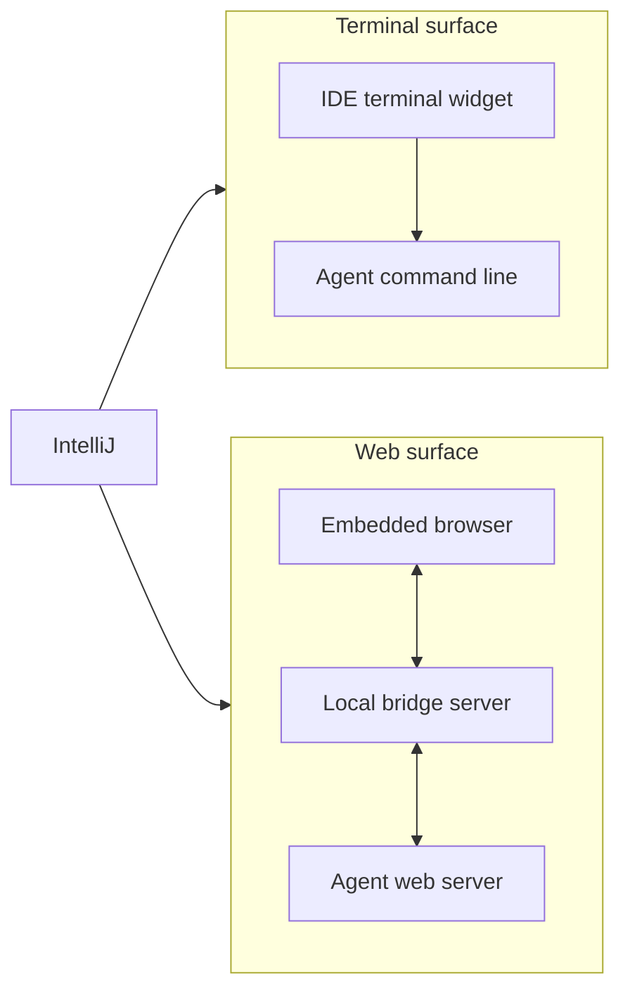

# Overview

What AgentellIJ does, and where it stops.

## What the plugin is for

AgentellIJ hosts a terminal-based AI coding agent inside IntelliJ IDEA. The agent keeps running in a
tool window on the right, sees which files are open, and can open files back in the editor.

The plugin does not contain an agent. It hosts one that the user already has.

## Where the plugin stops

The agent command-line tool owns the conversation, the reasoning, the tool calls, and the stored
conversation state. The plugin owns the surface that displays it and the IntelliJ context it feeds
in.

This boundary decides whether a request belongs here at all.

| Owned by the agent tool | Owned by the plugin |
|---|---|
| Conversation and its history | The tool window and the two surfaces |
| Model choice and prompting | Which agent is active, and its binary path |
| Reading and writing project files | Telling the agent which files are open |
| Conversation state on disk | Proxying that state to the web client |

Two rules follow from it. The plugin never becomes the owner of conversation or agent state, it only
passes them through. The bundled web client may cache what it renders, but that cache must have a
size limit and an eviction policy, because plugin memory is the user's IDE memory.

A request that fits none of the rows above belongs to the agent tool, not here.

## Supported agents

| Agent | Surfaces | Installation | Conversation state on disk |
|---|---|---|---|
| OpenCode | Terminal and web | `npm install -g opencode-ai` | Yes, in its own directory |
| Claude Code | Terminal | `npm install -g @anthropic-ai/claude-code` | No |
| Codex CLI | Terminal | `npm install -g @openai/codex` | No |
| Terminal | Terminal | None needed | No |

The Terminal entry is not an AI agent. It opens the IDE's own shell in the same tool window, so the
plugin's context shortcuts work against whatever the user runs there.

## The two surfaces

The tool window shows one of two surfaces. The toolbar switches between them without a restart, and
an agent that supports only the terminal keeps the toggle disabled.

The terminal surface runs the agent's own interface directly. The web surface starts the agent in
server mode, waits for it to announce its address, then loads its web interface in an embedded
browser. Only OpenCode offers a web interface, so only OpenCode can use the web surface.

## What the plugin adds

### Sharing context

The user adds files to the agent's context from the editor, the editor tab, or the project tree,
using `Ctrl+Shift+I` (`⌘⇧I` on macOS) or the right-click menu. A selection in the editor is sent as a
line range the agent can open again later. Files can also be dropped onto the web surface.

All three actions answer the same shortcut, so the one matching where the user is looking wins.

### Following the editor

Open files and the active editor are pushed to the agent as they change, so the agent knows what the
user is working on without being told.

### Installing a missing agent

When the selected agent is not installed, the tool window shows the exact command that would install
it and runs nothing until the user clicks Install. The installation runs in the background and can be
cancelled.

### Switching agents

The toolbar has an agent selector and a Change button. Choosing and applying are separate steps
because applying restarts the agent. Each agent remembers its own binary path, so pointing one at a
custom build does not disturb the others.
